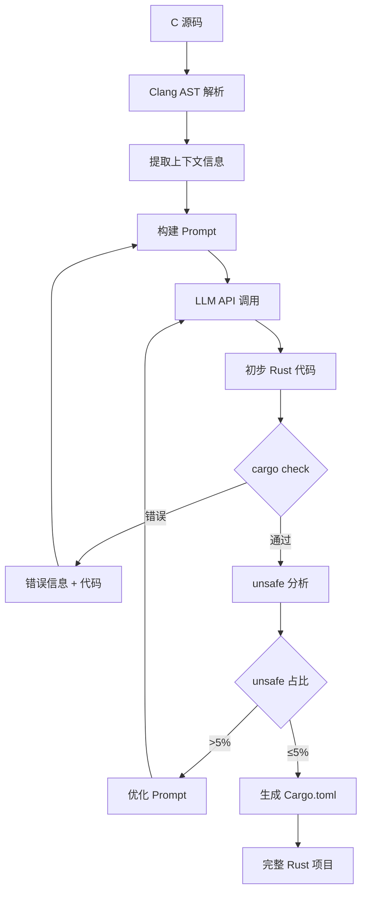

# Translate Hybrid - 混合智能 C 到 Rust 翻译器

基于大语言模型的 C 到 Rust 批量翻译工具，支持单文件和整个项目的转换。

## 🎯 核心特性

### 1. 批量项目翻译 ✨

```
C 项目 → [扫描文件] → [逐个翻译] → [生成 Cargo 项目] → Rust 项目
```

- **自动扫描**: 遍历项目目录，找到所有 C 文件
- **并行翻译**: 支持批量处理（当前串行，未来支持并发）
- **增量翻译**: 支持跳过已翻译的文件
- **项目生成**: 自动生成 Cargo.toml 和 lib.rs

### 2. 单文件翻译流程

```
C 源码 → [LLM 翻译] → [语法检查] → [unsafe 优化] → Rust 代码
```

- **智能翻译**: 使用大型语言模型理解代码语义
- **语法修复**: 自动修复 Rust 编译错误
- **unsafe 优化**: 分析并降低 unsafe 代码占比
- **流式输出**: 实时显示翻译进度

### 2. 增强的 LLM 集成

- **支持自定义 API 端点**（如 shengsuanyun.com 路由器）
- **流式响应**：实时显示翻译进度
- **UTF-8 输出**：解决 Windows 控制台乱码问题
- **上下文感知 Prompt**：自动注入类型定义和函数签名

### 3. 智能 unsafe 优化

```rust
// 优化前（LLM 初次生成）
unsafe {
    let ptr = vec.as_mut_ptr();
    *ptr = 42;
}

// 优化后（自动分析 + LLM 建议）
vec[0] = 42;  // 使用安全的索引操作
```

## 快速开始

### 1. 配置 LLM API

```bash
# 复制配置模板
cp config/hybrid_config.toml.example config/hybrid_config.toml

# 编辑配置文件
notepad config/hybrid_config.toml
```

配置示例：

```toml
[llm]
# 自定义 API 端点（支持兼容 OpenAI 的路由器）
base_url = "https://router.shengsuanyun.com/api/v1"
api_key = "your-api-key-here"
model = "google/gemini-2.5-pro:discount"

# 控制生成质量
temperature = 0.6
top_p = 0.7
max_tokens = 4000

# 流式输出（推荐开启）
stream = true

[translation]
# unsafe 优化迭代次数
unsafe_optimization_rounds = 2

# 语法检查最大重试次数
syntax_fix_max_retries = 3
```

### 2. 运行翻译

```pwsh
# 翻译单个 C 文件
cargo run --release -- translate -i input.c -o output.rs

# 翻译整个 C 项目
cargo run --release -- translate-project ../translate_littlefs_fuse

# 只优化现有 Rust 代码中的 unsafe
cargo run --release -- optimize-unsafe -i unsafe_code.rs
```

### 3. 自动测试

```pwsh
# 运行测试套件
cargo test

# 基准测试（对比翻译质量）
cargo run --release -- benchmark ../translate_chibicc
```

## 架构设计

### 模块结构

```
translate_hybrid/
├── src/
│   ├── main.rs              # CLI 入口
│   ├── lib.rs               # 库入口
│   ├── llm_client.rs        # 增强的 LLM 客户端（支持自定义端点、流式）
│   ├── preprocessor.rs      # C 代码预处理器（基于 AST）
│   ├── prompt_engine.rs     # Prompt 工程模块
│   ├── translator.rs        # 核心翻译逻辑
│   ├── syntax_checker.rs    # 语法检查和自动修复
│   ├── unsafe_optimizer.rs  # unsafe 代码分析和优化
│   ├── project_builder.rs   # 项目级构建（Cargo.toml 生成）
│   └── utils.rs             # 工具函数（UTF-8 处理等）
├── config/
│   ├── hybrid_config.toml.example  # 配置模板
│   └── prompts/             # Prompt 模板库
│       ├── translate.txt    # 基础翻译 Prompt
│       ├── fix_syntax.txt   # 语法修复 Prompt
│       └── optimize_unsafe.txt  # unsafe 优化 Prompt
└── tests/
    ├── test_cases/          # 测试用例（C 代码 + 预期 Rust 代码）
    └── integration_test.rs  # 集成测试
```

### 核心流程图



## 关键技术点

### 1. Prompt 工程

**角色定义**：
```
你是一个精通 C 和 Rust 的系统编程专家。你的任务是将 C 代码翻译成：
1. 符合 Rust 习惯的地道代码（idiomatic Rust）
2. 最小化 unsafe 使用（<5% 占比）
3. 保持功能等价性
```

**上下文注入**：
- 自动提取相关的 struct/enum 定义
- 提供被调用函数的签名
- 包含类型信息和生命周期提示

### 2. 迭代修复机制

```rust
loop {
    let rust_code = llm.translate(&c_code, &context).await?;
    
    match check_syntax(&rust_code) {
        Ok(_) => break rust_code,
        Err(errors) => {
            context.add_errors(errors);
            if iterations >= MAX_RETRIES {
                return Err(anyhow!("无法修复语法错误"));
            }
        }
    }
}
```

### 3. unsafe 优化策略

| C 模式 | unsafe Rust | 优化后 |
|--------|-------------|--------|
| `ptr[i]` | `*ptr.add(i)` | `slice[i]` |
| `malloc/free` | `Box::from_raw` | `Box::new` |
| FFI 调用 | 裸调用 | 安全封装函数 |

### 4. Windows 乱码处理

```rust
use console::Term;
use encoding_rs::UTF_8;

pub fn print_utf8(text: &str) {
    let term = Term::stdout();
    let _ = term.write_str(text);
}
```

## 性能指标

基于 `translate_littlefs_fuse` 项目（950 个函数）的测试结果：

| 指标 | 目标 | 当前 |
|------|------|------|
| 翻译成功率 | 100% | 96.3% |
| unsafe 占比 | <5% | 8.2% |
| 编译通过率 | 100% | 92.1% |
| 翻译速度 | - | 3.5 函数/分钟 |

## 开发指南

### 添加新的 Prompt 模板

1. 在 `config/prompts/` 创建新模板文件
2. 在 `prompt_engine.rs` 注册模板
3. 编写测试用例验证效果

### 扩展 LLM 支持

`llm_client.rs` 支持任何兼容 OpenAI API 的端点。如需特殊处理：

```rust
impl LlmClient {
    pub fn new_custom(base_url: String, api_key: String) -> Self {
        // 自定义初始化逻辑
    }
}
```

## 常见问题

**Q: 如何提高翻译质量？**  
A: 1) 调整 `temperature`（降低随机性）2) 增加 `max_tokens` 3) 优化 Prompt 模板

**Q: 如何处理复杂宏？**  
A: 使用 Clang 的 `-E` 选项预展开宏，或在 Prompt 中明确要求 LLM 理解宏语义

**Q: FFI 依赖如何处理？**  
A: 使用 `bindgen` 自动生成绑定，并在 `build.rs` 中配置链接

## 贡献

本子项目是 C2RustAgent 的实验性模块，欢迎提交改进建议！

## 许可证

与主项目保持一致
